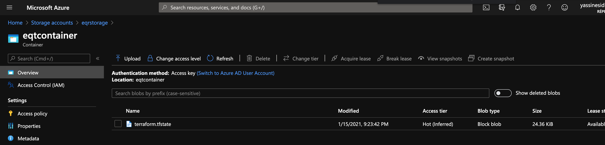

# Overview

Devops For Microsoft Azure Udacity Final Project

# Project Structure

- **azure-piplines.yaml**: azure pipelines yaml
- **automatedtesting/**: suites of automated tests
  - **jmeter**: load test files (.jmx) and CSV inputs
  - **postman**: Integration tests postman: Environments + Collections
  - **selenium**: Functional Ui test
- **fakerestapi**: Api to deploy
- **screens**: all screenshots
- **terraform**: terraform folder

---

## Provisioning azure resources using Terraform

- The following screenshot showing the output of init, plan and apply terraform tasks

  

- Here is tfstate well uploaded and updated to the used container

  

## FakerestAPI deployment

- See azurepipelines.yaml for more details about how to deploy webapp ASP.NET

  

## Automated Testing

- Load test suite : Endurance tests

  

- Load test suite : Stress tests

  

- Functional test suites

  - screenshot of the execution of the test suite by the CI/CD pipeline
    

- API-integration tests
  - screenshot of the Run Summary page (which contains 4 graphs)
    
  - screenshot of the Test Results page (which contains the test case titles from each test)
    
  - screenshot of the output of the Publish Test Results step
    

## Monitoring & Observability

- Configure Azure Monitor

  - screenshots of the email received when the alert is triggered
    
  - screenshots of the graphs of the resource that the alert was triggered
    
  - screenshots of the alert rule
    
    
    

- Azure Log Analytics
  - screenshots of log analytics queries and result sets which will show specific output of the Azure resource
    
